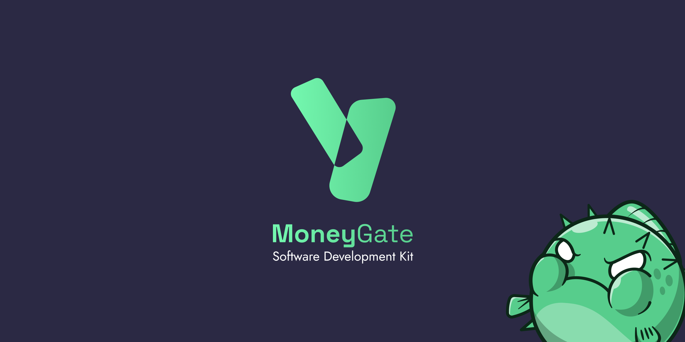

# Moneygate PHP SDK



PHP SDK to interact with Moneygate API

Moneygate API documentation available [here](https://docs.master.blowfish.api4ftx.cloud/)


## Developer Documentation

The [docs folder](docs/) provides detailed guides for using this library.

## Installation 
This library can be found on [Packagist](https://packagist.org/packages/homi/sdk_moneygate).
The recommended way to install this is through [composer](http://getcomposer.org).
```bash
$composer require homi/sdk_moneygate
```

## Quick start

```php
<?php 
use Dotenv\Dotenv;
use sdk_moneygate\Auth;
use sdk_moneygate\Balance;

class BalanceExample
{
    public function getBalanceExample(): array
    {
        $dotenv = Dotenv::createImmutable(__DIR__);
        $dotenv->load();

        $auth = new Auth($_ENV['privateKey'], $_ENV['Token']);

        $result = new Balance($auth, true);

        return $result;
    }
}
?>

```
## Examples

[Usage examples available here](examples/)

## Tests

```bash
vendor/bin/phpunit
```

